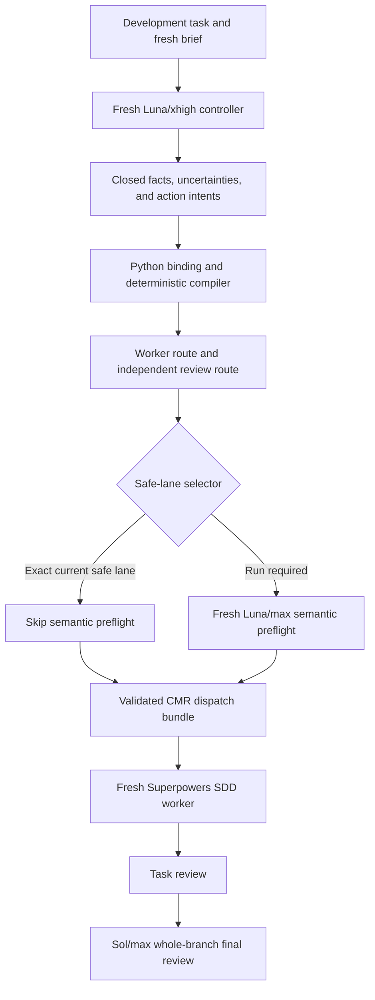

# Codex Model Router

[](https://github.com/luandemelo/codex-model-router/actions/workflows/ci.yml)
[](LICENSE)
[](docs/dependencies.md)

Codex Model Router (CMR) is a quality-first Codex plugin that routes
development work between `gpt-5.6-luna` and `gpt-5.6-sol`. A small model
response identifies facts and uncertainties; deterministic Python code owns
the model, reasoning effort, review level, recurrence, lifecycle, and external
authorization decisions.

CMR is designed for teams that want lower model cost on bounded work without
allowing cost, urgency, or social pressure to weaken the quality gates for
high-risk work.

> **Distribution status:** the skills-only plugin package is available from
> this repository at version `0.4.0`. It is not yet listed in the universal
> Plugins Directory. The supported path today is direct skill installation
> from GitHub or local plugin testing.

## Contents

- [Why CMR exists](#why-cmr-exists)
- [When to use it](#when-to-use-it)
- [Quick start](#quick-start)
- [How it works](#how-it-works)
- [Routing policy](#routing-policy)
- [Core concepts](#core-concepts)
- [CLI and contracts](#cli-and-contracts)
- [Dependencies](#dependencies)
- [Authorization and safety](#authorization-and-safety)
- [Repository layout](#repository-layout)
- [Contributing](#contributing)
- [Project status and license](#project-status-and-license)

## Why CMR exists

Development tasks do not all have the same blast radius. Updating isolated
copy, reconciling a small data set, migrating a database schema, debugging a
race condition, and reviewing a release should not automatically receive the
same model or reasoning budget.

Simple routing prompts are easy to override accidentally: a deadline, a cost
request, or an optimistic description can lower the route even when the task
contains a hard gate. CMR separates model judgment from routing authority:

- the controller reports only closed facts, uncertainties, and action intents;
- Python validates and binds that report to fresh task evidence;
- the compiler applies a fixed precedence order;
- the dispatcher accepts only a complete, validated handoff;
- task review and whole-branch final review remain independent.

The result is an auditable route that cannot be weakened by authored prose or
by a model selecting its own model, effort, or review level.

## When to use it

Use CMR before delegating development work through Superpowers SDD when any of
the following matters:

- task risk or blast radius should determine model strength;
- repeated failures must escalate instead of consuming more cheap attempts;
- architecture, security, concurrency, migrations, or release review is in
  scope;
- Luna should handle eligible bounded work without using low or medium effort;
- external actions such as issues, pushes, pull requests, merges, deployments,
  tags, releases, or plugin installation require separate authorization;
- you need a machine-checkable record of why a route was selected.

CMR is intentionally unnecessary for conversations that do not dispatch
development work or do not need a controlled Luna/Sol routing decision.

## Quick start

### 1. Check the host requirements

You need:

- a Codex app, CLI, or IDE surface with skills and subagents;
- account access to `gpt-5.6-luna` and `gpt-5.6-sol`;
- Superpowers with `superpowers:subagent-driven-development` (tested with
  Superpowers 6.3.0);
- Python 3.10 or newer and Git for local validation and contribution.

See [Dependencies](#dependencies) for the complete boundary.

### 2. Install the skill directly from GitHub

In a Codex conversation, invoke the built-in skill installer with the public
skill path:

```text
$skill-installer Install the skill from https://github.com/luandemelo/codex-model-router/tree/main/skills/codex-model-router
```

The installed skill becomes available on the next turn. Start a fresh
conversation before evaluating its routing behavior.

### 3. Select the controller model and effort

Before invoking CMR for a new development task, select **GPT-5.6 Luna** with
**Extra High (`xhigh`)** reasoning effort in the Codex model picker. This is the
controller route required by the CMR contract. Do not select Sol manually for
the controller, and do not use low, medium, or high effort.

CMR chooses the worker and reviewer routes after it validates the task facts.
The active conversation is not retroactively switched to another model; start
the task with the controller configuration above.

### 4. Route a development task

Invoke the skill explicitly and include the task, constraints, and relevant
repository context:

```text
$codex-model-router Route this task before implementation:

Migrate the production user table to a new primary-key format. Preserve
backward compatibility during rollout and include rollback verification.
```

This example contains a schema migration, so the deterministic hard-gate policy
selects Sol/max for planning, execution, and the required review phases. A
bounded isolated task can route to Luna/xhigh or Luna/max when its validated
facts satisfy the published policy.

CMR prepares and validates the route. It does not silently push code, create a
GitHub issue, merge a pull request, deploy, or publish a release.

### Full plugin testing

This repository also contains the plugin manifest at
`.codex-plugin/plugin.json`. The package is not yet published in the universal
Plugins Directory. Maintainers testing the complete plugin should add it to a
local marketplace, install it from the Plugins Directory, start a new
conversation, and run representative positive, negative, and boundary
requests. See the
[official plugin testing guide](https://developers.openai.com/plugins/deploy/connect-chatgpt).

## How it works



The control flow has six stages:

1. **Controller:** a fresh Luna/xhigh occurrence emits only a closed
   `cmr-controller-result-v1` envelope.
2. **Binding:** runtime code binds the response to the fresh task brief,
   occurrence identity, hashes, usage, and repository context.
3. **Compilation:** code derives risk, recurrence, worker route, review route,
   lifecycle, and external-action state.
4. **Preflight selection:** only an exact current safe-lane entry can skip a
   fresh Luna/max semantic preflight.
5. **Dispatch:** a complete `cmr-dispatch-bundle-v1` must validate before a
   worker is started.
6. **Execution and review:** Superpowers SDD receives a fresh scoped brief;
   task review and Sol/max final review remain separate occurrences.

For the detailed invariants, read
[`docs/architecture.md`](docs/architecture.md),
[`routing-policy.md`](skills/codex-model-router/references/routing-policy.md),
and
[`execution-contract.md`](skills/codex-model-router/references/execution-contract.md).

## Routing policy

| Validated situation | Worker | Task review |
| --- | --- | --- |
| Hard gate, recurrence, canonical planning, or final review | Sol/max | Sol/max |
| Integration or elevated risk | Sol/xhigh | Sol/xhigh |
| Eligible low-blast-radius audit, reconciliation, judgment, or approved local work | Luna/max | Luna/max |
| Default isolated work | Luna/xhigh | Luna/max |

Important invariants:

- Luna/xhigh is the minimum controller route; CMR does not use low, medium, or
  high reasoning effort.
- Canonical planning and whole-branch final review are always Sol/max.
- Two complete failures of the same defect, or a defect that reappears after a
  declared resolution, stays Sol/max.
- Cost, quota, urgency, deadlines, authority, sunk cost, diff size, and social
  pressure never reduce a route.
- A semantic preflight adjudicates the control plane. It is not worker
  execution and cannot replace task review.
- Historical Quality-First Routing (QFR) records are documentary only and
  cannot authorize CMR dispatch.

## Core concepts

| Term | Meaning |
| --- | --- |
| **Controller** | Fresh Luna/xhigh call that reports only ontology-backed facts, uncertainties, and action intents. |
| **Occurrence** | Audited record of one model call, including phase, scope, hashes, usage, thread policy, and acceptance state. |
| **Compiler** | Standard-library Python code that owns route precedence and derives the complete decision. |
| **Safe lane** | Frozen, plan-bound evidence for a narrowly eligible task that may skip semantic preflight. |
| **Semantic preflight** | Fresh Luna/max control-plane adjudication that can accept, replace with a stronger route, or block. |
| **Dispatch bundle** | Complete validated handoff containing route evidence, preflight state, and the materialized worker brief. |
| **Recurrence** | A repeated failure of the same bound defect; recurrence escalates fail-closed to Sol/max. |
| **Hard gate** | A fact such as security-sensitive work, schema migration, concurrency, architecture, or final review that requires Sol/max. |
| **External action** | A separately authorized mutation such as issue creation, push, PR, merge, deployment, tag, release, installation, or publication. |

## CLI and contracts

The skill includes a standard-library Python CLI for contract validation,
compilation, migration inspection, and occurrence auditing:

```bash
python3 -B skills/codex-model-router/scripts/codex_model_router.py --help
```

| Command | Purpose |
| --- | --- |
| `validate-controller` | Validate one closed controller result. |
| `compile` | Bind validated evidence and derive the complete route decision. |
| `validate-dispatch` | Validate a complete CMR dispatch bundle before handoff. |
| `validate-legacy` | Inspect one historical QFR decision without authorizing dispatch. |
| `audit-occurrence` | Validate call shape, metadata binding, response policy, and usage for one occurrence. |
| `check-call-shape` | Validate canonical serialized occurrence records or accounting input. |

For example, from the repository root:

```bash
python3 -B skills/codex-model-router/scripts/codex_model_router.py \
  validate-controller controller-result.json
```

Commands read JSON or JSONL files, emit one canonical JSON object, return zero
only for accepted input, and write concise rejection diagnostics to stderr.
Planning occurrences require the exact trusted `planning_task_ids` order;
other phases forbid that field. Serialized occurrence records must be strict,
closed, duplicate-free `cmr-occurrence-audit-v1` objects.

Published JSON Schemas live under
[`references/schemas/`](skills/codex-model-router/references/schemas/), and the
closed ontology vocabularies live directly under
[`references/`](skills/codex-model-router/references/).

## Dependencies

Required host capabilities:

- Codex with skills, subagents, and access to the exact model slugs used by the
  routing policy;
- Superpowers 6.3.0 with
  `superpowers:subagent-driven-development` (host dependency, not bundled);
- Python 3.10+ using the standard library only;
- Git for local history and review workflows.

There is no runtime PyPI, npm, database, hosted-service, API-key, or MCP
dependency. Python 3.10, 3.11, 3.12, and 3.13 are exercised in CI.

GitHub CLI and GitHub Issues are optional integrations for separately
authorized repository workflows. Model availability, Codex skill/subagent
support, and Superpowers are host capabilities rather than bundled
dependencies. See [`docs/dependencies.md`](docs/dependencies.md) for the full
matrix and limitations.

## Authorization and safety

CMR separates preparation from permission. Issue creation, repository
settings, pushes, pull requests, merges, deployments, tags, releases, plugin
installation, and marketplace publication each require their own scoped
authorization, exact preview, execution, and readback.

A previous approval, generic GitHub permission, or a prepared preview does not
authorize a different action. CMR records the lifecycle state but has no
automatic GitHub network or shell side effects.

CMR does not:

- observe or validate a model's hidden reasoning;
- guarantee account access to a model or reasoning effort;
- create missing evidence, retry malformed model responses, or repair an
  invalid route;
- replace human review for business, security, legal, or operational risk;
- turn historical QFR artifacts into current dispatch authority.

Report vulnerabilities privately using [`SECURITY.md`](SECURITY.md).

## Repository layout

```text
.
├── .codex-plugin/plugin.json       # Plugin identity and skill entry point
├── .github/workflows/ci.yml        # Python 3.10-3.13 verification
├── docs/                           # Architecture, dependencies, migration
├── skills/codex-model-router/
│   ├── SKILL.md                    # Codex workflow instructions
│   ├── agents/openai.yaml          # Skill interface metadata
│   ├── assets/                     # Reusable AGENTS.md routing snippet
│   ├── references/                 # Policies, ontologies, and JSON Schemas
│   ├── scripts/                    # Runtime, compiler, dispatcher, and CLI
│   └── tests/                      # Deterministic unit and contract tests
├── CONTRIBUTING.md                 # Contribution workflow and DCO
├── SECURITY.md                     # Private vulnerability reporting
└── CHANGELOG.md                    # Public release history
```

## Contributing

Bug reports, documentation improvements, new deterministic test cases, policy
clarifications, compatibility fixes, and narrowly scoped implementation
changes are welcome.

Before opening a pull request:

1. Start with a clear issue or specification and keep the change focused.
2. Create a branch from `main`.
3. Add a deterministic regression test before behavior changes.
4. Update documentation and `CHANGELOG.md` when public behavior or contracts
   change.
5. Run the complete local checks.
6. Sign every commit with the Developer Certificate of Origin.

Clone and verify the project without installing runtime dependencies:

```bash
git clone https://github.com/luandemelo/codex-model-router.git
cd codex-model-router
python3 -B -m unittest discover -s skills/codex-model-router/tests -p 'test_*.py' -v
python3 -B skills/codex-model-router/scripts/check_public_release.py .
git diff --check
```

Sign a commit with:

```bash
git commit -s
```

A contribution is ready for review when tests pass, the public release checker
reports zero errors, JSON and documentation remain valid, the diff contains no
private data or generated caches, and the pull request explains the problem,
the chosen approach, and the verification evidence.

Read [`CONTRIBUTING.md`](CONTRIBUTING.md) for the full DCO and submission
requirements. Use [`SECURITY.md`](SECURITY.md) instead of a public issue for a
suspected vulnerability.

## Project status and license

The current public contract version is `0.4.0` and is actively evolving.
Breaking contract changes, migrations, and compatibility notes are documented
in [`CHANGELOG.md`](CHANGELOG.md). Existing QFR users should follow the
[`migration guide`](docs/migration-from-quality-first-routing.md) instead of
reusing documentary artifacts as CMR dispatch authority.

Codex Model Router is licensed under the
[Apache License 2.0](LICENSE). See [`NOTICE`](NOTICE) for attribution details.
